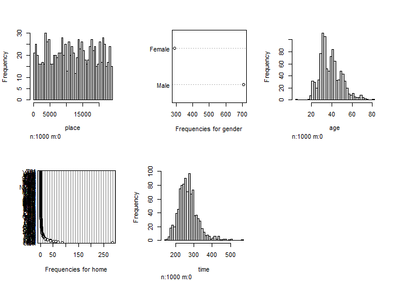
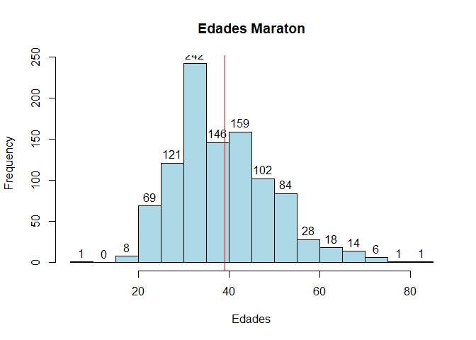

Clase 2
================

*REGRESAR AL HOME: [https://analisismultivariado.com/](https://analisismultivariado.com) 


## Instalando la libreria

``` r
# install.packages("UsingR")
# install.packages("DataExplorer")
```

## Llamado de Librerias

``` r
library(lattice)
library(survival)
library(Formula)
library(ggplot2)
library(MASS) 
library(HistData)
library(Hmisc)
```


    Attaching package: 'Hmisc'

    The following objects are masked from 'package:base':

        format.pval, units

``` r
library(UsingR)
```


    Attaching package: 'UsingR'

    The following object is masked from 'package:survival':

        cancer

``` r
library(DataExplorer)
```

## Leyendo los datos

``` r
data("nym.2002")
head(nym.2002)
```

          place gender age home     time
    3475   3592   Male  52  GBR 217.4833
    13594 13853 Female  40   NY 272.5500
    12012 12256   Male  31  FRA 265.2833
    10236 10457 Female  33   MI 256.1500
    9476   9686   Male  33   NY 252.2500
    1720   1784   Male  40   NJ 201.9667

## Estadistica Descriptiva

``` r
mean(nym.2002$age)
```

    [1] 39.1

``` r
hist(nym.2002)
```

<!-- -->

## Customizando el Histograma

``` r
hist(nym.2002$age, col="lightblue", main = "Edades Maraton", xlab = "Edades", freq = TRUE, labels = TRUE)
abline(v= mean(nym.2002$age), col='red')
```

<!-- -->

## Libreria Data Explorer

### Reporte

``` r
# create_report(nym.2002)
```

## Grafica de Barras

``` r
plot_bar(nym.2002)
```

    1 columns ignored with more than 50 categories.
    home: 73 categories

<!-- -->

## Histogramas

``` r
plot_histogram(nym.2002)
```

<!-- -->

``` r
plot_histogram(nym.2002$time)
```

<!-- -->

## Grafica de Densidad

``` r
plot_density(nym.2002)
```

<!-- -->

## Box plot

``` r
plot_boxplot(nym.2002, by = "age")
```

<!-- -->

``` r
plot_boxplot(nym.2002, by = "time")
```

<!-- -->
