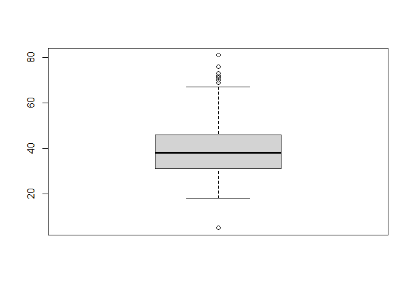
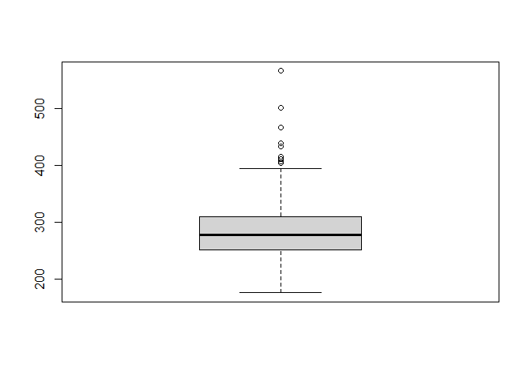

Clase 2
================

## Instalando la libreria

``` r
#install.packages("UsingR")
```

``` r
library(UsingR)
```

    ## Loading required package: MASS

    ## Loading required package: HistData

    ## Loading required package: Hmisc

    ## Loading required package: lattice

    ## Loading required package: survival

    ## Loading required package: Formula

    ## Loading required package: ggplot2

    ## 
    ## Attaching package: 'Hmisc'

    ## The following objects are masked from 'package:base':
    ## 
    ##     format.pval, units

    ## 
    ## Attaching package: 'UsingR'

    ## The following object is masked from 'package:survival':
    ## 
    ##     cancer

``` r
library(dplyr)
```

    ## 
    ## Attaching package: 'dplyr'

    ## The following objects are masked from 'package:Hmisc':
    ## 
    ##     src, summarize

    ## The following object is masked from 'package:MASS':
    ## 
    ##     select

    ## The following objects are masked from 'package:stats':
    ## 
    ##     filter, lag

    ## The following objects are masked from 'package:base':
    ## 
    ##     intersect, setdiff, setequal, union

## Leyendo los datos

``` r
data("nym.2002")
head(nym.2002)
```

    ##       place gender age home     time
    ## 3475   3592   Male  52  GBR 217.4833
    ## 13594 13853 Female  40   NY 272.5500
    ## 12012 12256   Male  31  FRA 265.2833
    ## 10236 10457 Female  33   MI 256.1500
    ## 9476   9686   Male  33   NY 252.2500
    ## 1720   1784   Male  40   NJ 201.9667

``` r
mean(nym.2002$age)
```

    ## [1] 39.1

``` r
hist(nym.2002)
```

<!-- -->

``` r
hist(nym.2002$age, col="lightblue", main = "Edades Maraton", xlab = "Edades", freq = TRUE, labels = TRUE)
abline(v= mean(nym.2002$age), col='red')
```

<!-- -->

``` r
boxplot(nym.2002$age)
```

<!-- -->

``` r
muje <- filter(nym.2002, gender =="Female" )
```

``` r
boxplot(muje$time)
```

<!-- -->
